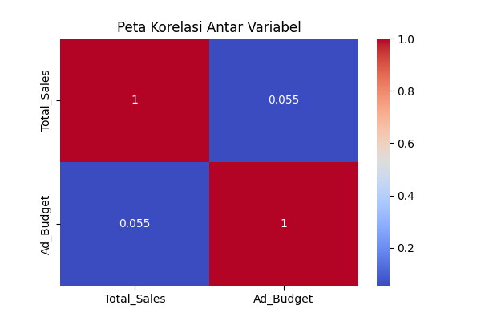

# 📊 Analisis dan Visualisasi Data Penjualan

## 📌 Deskripsi Singkat
Pada proyek ini, saya melakukan analisis data penjualan menggunakan Python. Tujuannya adalah untuk mengetahui pola penjualan, melihat produk yang paling laku, serta memahami pengaruh iklan terhadap penjualan.

---

## 🎯 Tujuan
- Mengetahui perkembangan penjualan dari waktu ke waktu  
- Mengetahui kategori produk yang paling banyak terjual  
- Memahami perilaku pelanggan  
- Mengetahui apakah iklan berpengaruh terhadap penjualan  

---

## 🛠️ Tools yang Digunakan
- Python  
- pandas  
- matplotlib  
- seaborn  
- scikit-learn  

---

## 🔄 Langkah-Langkah yang Dilakukan

### 1. Membaca dan Membersihkan Data
Data dibaca dari file CSV, lalu dicek apakah ada data kosong atau tidak. Selain itu, data yang tidak masuk akal (misalnya penjualan negatif) dihapus.  

👉 Tujuannya supaya data yang digunakan lebih akurat.

---

### 2. Analisis Tren Penjualan
Data penjualan dikelompokkan per bulan, lalu dibuat grafik garis.  

👉 Dari sini bisa dilihat apakah penjualan naik atau turun setiap bulan.

---

### 3. Analisis Produk
Data dikelompokkan berdasarkan kategori produk.  

👉 Tujuannya untuk mengetahui produk mana yang paling banyak menghasilkan penjualan.

---

### 4. RFM Analysis (Analisis Pelanggan)
Pelanggan dianalisis berdasarkan:
- Recency (terakhir belanja)  
- Frequency (seberapa sering belanja)  
- Monetary (total belanja)  

👉 Ini membantu mengetahui pelanggan yang paling aktif dan menguntungkan.

---

### 5. Analisis Kategori Produk
Data ditampilkan dalam bentuk grafik batang.  

👉 Lebih mudah melihat perbandingan antar kategori produk.

---

### 6. Analisis Pengaruh Iklan
Data dibagi menjadi:
- Iklan tinggi  
- Iklan rendah  

Lalu dibandingkan rata-rata penjualannya.  

👉 Tujuannya untuk melihat apakah iklan berpengaruh terhadap penjualan.

---

### 7. Analisis Korelasi
Menggunakan heatmap untuk melihat hubungan antara:
- Anggaran iklan  
- Total penjualan  

👉 Untuk mengetahui apakah kedua data saling berhubungan.

---

### 8. Regresi Linear (Prediksi)
Digunakan untuk memprediksi penjualan berdasarkan anggaran iklan.  

👉 Hasilnya berupa:
- Seberapa besar pengaruh iklan  
- Seberapa akurat model prediksi  

---

### 9. Visualisasi Tambahan
Grafik scatter dibuat untuk melihat hubungan antara:
- Anggaran iklan  
- Total penjualan  

👉 Supaya hubungan antar data terlihat lebih jelas.

---

## 📈 Kesimpulan
- Penjualan dapat berubah setiap bulan  
- Terdapat kategori produk yang lebih unggul  
- Anggaran iklan memiliki pengaruh terhadap penjualan  
- Data dapat digunakan untuk prediksi sederhana  

---

## 💡 Pesan
Dengan analisis data, kita dapat mengambil keputusan yang lebih tepat karena didasarkan pada data, bukan hanya perkiraan.

---
